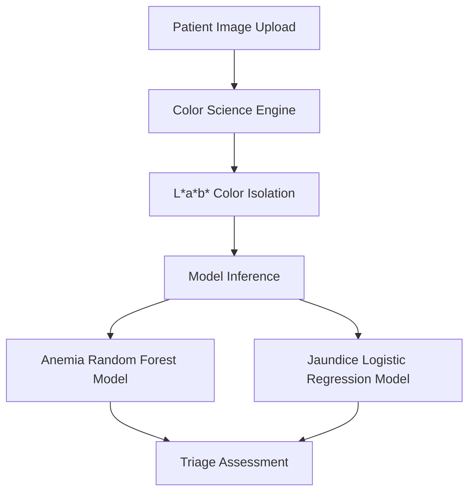

# Hemo-Sclera System Architecture

Hemo-Sclera is a multimodal diagnostic triage system designed for non-invasive anemia and jaundice screening.

## System Components

1. **Streamlit UI (`app.py`)**: Local diagnostic dashboard for practitioners.
2. **Next.js Frontend (`pages/index.js`)**: Modern web portal optimized for performance and accessibility.
3. **Inference Engine (`engine/inference.py`, `pages/api/infer.js`)**: Connects to OpenRouter using `google/gemini-2.5-flash` with a robust multi-model fallback cascade.
4. **Color Science Modules (`engine/color_logic.py`)**: Implements CIE L*a*b* conversions to isolate physiological attributes from illumination variations.
